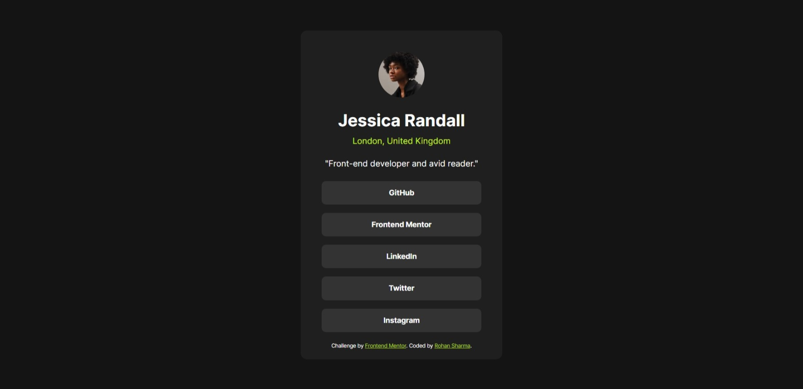

# Frontend Mentor - Social links profile solution

This is a solution to the [Social links profile challenge on Frontend Mentor](https://www.frontendmentor.io/challenges/social-links-profile-UG32l9m6dQ). Frontend Mentor challenges help you improve your coding skills by building realistic projects.

## Table of contents

- [Frontend Mentor - Social links profile solution](#frontend-mentor---social-links-profile-solution)
  - [Table of contents](#table-of-contents)
  - [Overview](#overview)
    - [The challenge](#the-challenge)
    - [Screenshot](#screenshot)
    - [Links](#links)
  - [My process](#my-process)
    - [Built with](#built-with)
    - [What I learned](#what-i-learned)
  - [Author](#author)

## Overview

### The challenge

Users should be able to:

- See hover and focus states for all interactive elements on the page

### Screenshot



### Links

- Solution URL: [Frontend Mentor](https://your-solution-url.com)
- Live Site URL: [Social Links Profile](https://rohan843-social-links-profile.netlify.app/)

## My process

### Built with

- Semantic HTML5 markup
- CSS custom properties
- Flexbox

### What I learned

To center a div vertically on the page, but to allow for a scroll in case the div's height exceeds the viewport's, we can give its parent container (here, `body`) a `min-height` of 100%. This ensures that the `body` will be _atleast_ as tall as the screen, but will increase in height if the inner content requires more height, thus preventing overflows. Then, the `html` tag will allow for an overflow scrollbar.

```html
<html>
  <body>
    <div class="container">
      <!-- Other html here -->
    </div>
  </body>
</html>
```

```css
html {
  height: 100%;
}

body {
  margin: 0;
  min-height: 100%;
  display: flex;
  align-items: center;
  justify-content: center;
}

.container {
  height: max-content;
  width: calc(90% - 80px);
  max-width: 305px;
  margin: 24px;
}
```

## Author

- Website - [Rohan Sharma](https://rohan843.netlify.app/)
- Frontend Mentor - [@rohan843](https://www.frontendmentor.io/profile/rohan843)
